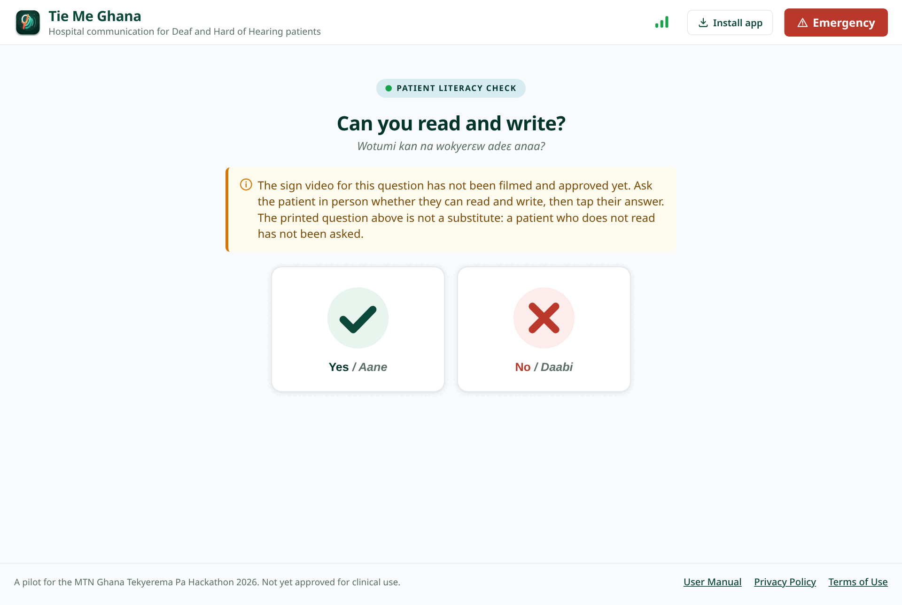
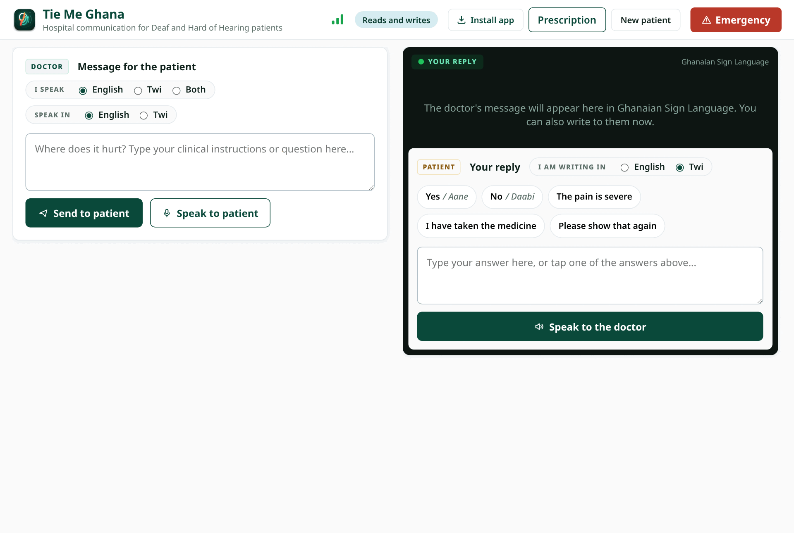
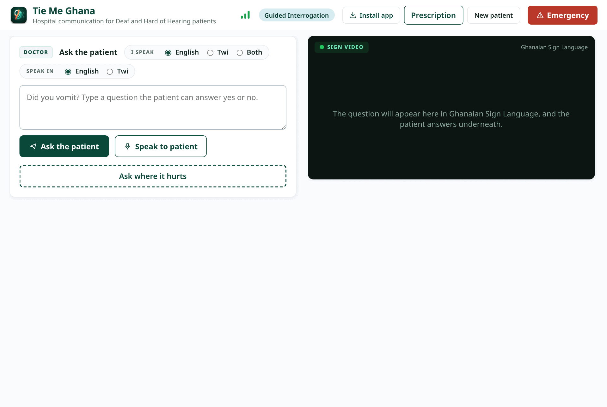
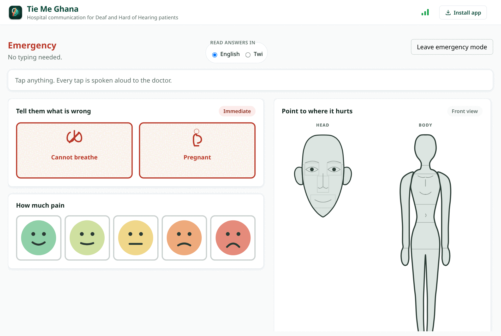
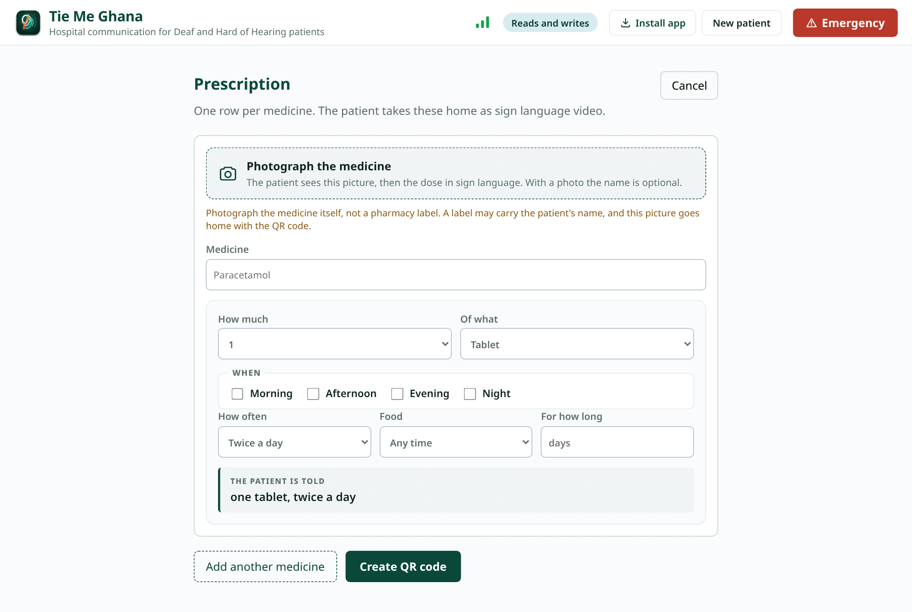

# Tie Me Ghana

A hospital communication system for Deaf and Hard of Hearing patients in
Ghanaian hospitals. Built for the MTN Ghana Tekyerema Pa Hackathon 2026.

Twi is the spoken and written language. Ghanaian Sign Language (GhSL) is the
primary visual channel.

## The problem, in one paragraph

A Deaf patient in a Ghanaian hospital cannot hear their name called in the
queue, cannot explain what happened after an accident, and cannot rely on an
interpreter being available for a walk in visit. Pen and paper is not the
answer either, because fluency in GhSL does not imply fluency in written
English. We call that the literacy trap, and it is the specific gap this
project is built around. The problem was identified by a Deaf member of our
own team from personal experience, and the published research corroborates it
rather than originates it.

## What it does

**Doctor to patient.** Spoken or typed English or Twi is transcribed,
translated to Twi, captioned on screen, then tokenized and matched against a
library of reviewed GhSL clips which are stitched into one sign video.
Unmatched words fall back to fingerspelling.

**Patient to doctor.** Every patient response, typed or tapped, is spoken
aloud to the hearing clinician in Twi or English, chosen once per session. Tap
selected answers are spoken too, so the doctor hears the answer without
looking at the screen.

**The literacy branch.** At first use, a sign video only prompt with no text
asks whether the patient reads and writes. Literate patients get free
captioning and typed replies. Non literate patients get Guided Interrogation
Mode instead: the doctor picks from a fixed, pre reviewed clinical question
bank, the app plays it as a sign video, and the patient answers by tapping
sign video options or by nodding, observed by the doctor in person. No camera
based gesture detection.

**Privacy by architecture.** The session transcript is canonical on the
patient's own device, never on a shared server. That is a structural property
of the system, not a permissions setting that could be misconfigured.

## What it looks like

Screenshots of the running app, captured from it rather than mocked up. They
are regenerated by `npm run manual` in `frontend/`, so they cannot drift away
from what the app actually does.

The same screens appear in the **[user manual](frontend/public/tie-me-ghana-manual.pdf)**
with every control numbered and explained.

### The opening screen

One question decides how the whole visit works, and it is asked in sign video
rather than in print. Emergency mode is reachable from here without answering
it first.

### Talking to a patient who reads

The clinician types on the left, the patient reads and replies on the right,
on one device turned between them. `I speak` accepts English, Twi, or both at
once, because clinical speech in Ghana moves between them inside a sentence.

### Talking to a patient who does not read

Guided Interrogation. Every question is asked as a sign video and answered by
tapping, so nothing depends on written language. The answers appear where the
video was, so the patient is not asked to look somewhere else.

### Emergency mode

For an accident or a collapse. No typing, no reading, and no dependency on
footage having been filmed: the pain scale and the body map are drawings, and
every tap is spoken aloud to whoever is treating the patient.

### Writing a prescription

The doctor photographs the medicine rather than typing its name, and chooses
the dose from a fixed vocabulary so that every prescription the app can
produce is one it can also sign. The patient takes home a QR code that replays
the whole list in GhSL.

## Status

**P0 and P1 are complete.** Doctor to patient captioning with GhSL rendering,
the literacy check and Guided Interrogation, patient responses spoken aloud,
the on device transcript, Emergency Visual Triage and prescription playback
are all built and tested. 808 tests, both halves green: 326 backend, 482
frontend.

It is deployed, on Netlify and Render with media in Cloudflare R2 and the
database on Neon. See [DEPLOY.md](DEPLOY.md).

What the system still needs is not code. It needs **filmed GhSL footage**: the
clip library holds 102 glosses of which 8 are approved and filmed, so most
captions and questions correctly report that they cannot be signed yet. Drop
recordings into `backend/footage/` and coverage appears with no code change.
See [BACKLOG.md](BACKLOG.md) for the full picture.

## Architecture

| Layer | Choice | Why |
| --- | --- | --- |
| Frontend | React, Vite, PWA | Installs without an app store, works on intermittent connectivity, caches clips for offline replay |
| Backend | Django, Django REST Framework | Clip library, clinical question bank, and live session relay |
| Database | PostgreSQL | Reviewed clip and question data. **Not** patient transcripts |
| Transcripts | IndexedDB, on device | FR 4.2 and NFR 4, never transmitted without explicit patient action |
| Language | GhanaNLP Khaya AI | Twi ASR, translation, and TTS. General purpose Western tools fail on Twi |
| Sign rendering | Retrieval from a reviewed clip library | Generative sign synthesis is an unsolved research problem for every sign language globally |

The clip library, the clinical question bank, and the emergency alert set are
admin managed and reviewed by GhSL fluent consultants before use. They cannot
be created through the API, because an unreviewed medical sign carries real
clinical consequences.

## Getting started

See [SETUP_GUIDE.md](SETUP_GUIDE.md).

## Branches

| Branch | Purpose |
| --- | --- |
| `main` | Stable baseline |
| `develop` | Integration branch, features merge here first |
| `feature/p0-core-consultation` | Ongoing work, **commit and push here** |

Day to day work goes to the feature branch. `git push` with no arguments
already targets it. Merging into `develop` is a pull request, so CI validates
the change before it reaches an integration branch. See ADR 019.

## Working on this project

- [ENGINEERING_STANDARDS.md](ENGINEERING_STANDARDS.md), the workflow every
  feature follows, and how formatting and linting are enforced automatically
- [BACKLOG.md](BACKLOG.md), sprint plan with every requirement traced from the
  SRS to the code and test that satisfies it
- [DECISIONS.md](DECISIONS.md), why the architecture is the way it is, for
  every choice that would be expensive to reverse
- [DEVELOPMENT_LOG.md](DEVELOPMENT_LOG.md), what happened in each sprint, the
  commands that reproduce it, and the problems hit along the way
- [DEPLOY.md](DEPLOY.md), the two platforms, every environment variable each
  one needs, and the four things that fail quietly if they are missed
- `Tie_Me_Ghana_SRS_v2.pdf`, the requirements specification, source of truth
